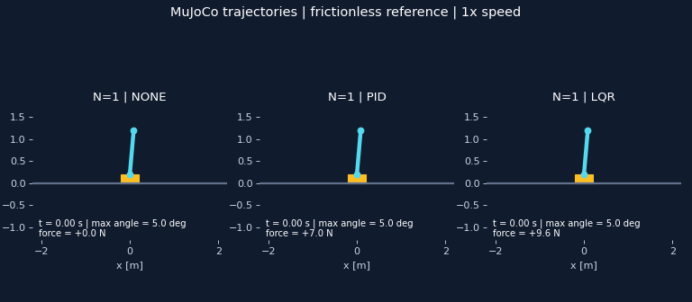
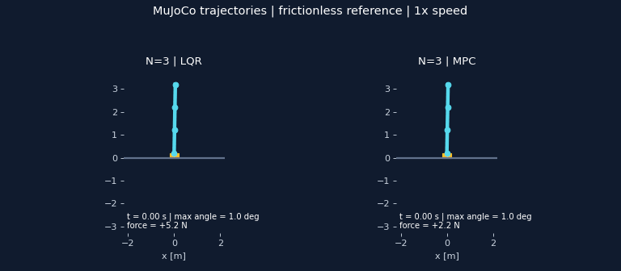

# Stick balancing — pendule inversé à N segments

Simulation d’un chariot qui maintient une chaîne articulée à la verticale. **MuJoCo calcule la physique** ; les modèles analytiques servent à concevoir les commandes PID, LQR et à horizon fini. Le projet permet de comparer les contrôleurs, mesurer leurs limites et reproduire les expériences.



*Une même inclinaison initiale de 5° à N=1, pendant 6 secondes. Sans contrôle, le pendule tombe ; PID et LQR le ramènent vers la verticale. Les images sont une représentation 2D des états réellement calculés par MuJoCo, à vitesse réelle.*



*N=3, première articulation inclinée de 1°, autres articulations à 0°. Articulations sans frottement, force limitée à ±100 N. Les petits mouvements ne sont pas amplifiés. Les paramètres et métriques des animations sont dans [manifest.json](docs/assets/manifest.json).*

## Démarrer

Depuis la racine du dépôt, avec Python et un environnement virtuel :

```powershell
python -m venv .venv
.venv\Scripts\Activate.ps1
python -m pip install -r requirements.txt
python -m pytest tests -q
python scripts/run_pid_n1.py --N 1 --theta-deg 5 --time 10
```

Sous Linux, remplacer l’activation par `source .venv/bin/activate`.
Si PowerShell empêche l’activation, utiliser directement `.venv\Scripts\python.exe` à la place de `python` ; il n’est pas nécessaire de changer la politique de sécurité.

Environnement effectivement utilisé pour la validation locale : **Windows, Python 3.14.2, MuJoCo 3.11.0, NumPy 2.4.1**. La CI est configurée pour Python 3.12/3.14 sur Windows et Ubuntu ; sa configuration ne constitue pas à elle seule une exécution réussie sur ces plateformes. Les dépendances sont déclarées dans [requirements.txt](requirements.txt).

Les simulations, tests, graphiques et GIF fonctionnent sans fenêtre OpenGL. L’interface interactive nécessite un affichage OpenGL et Tkinter.

## Ce que le cahier des charges demande et comment le vérifier

La référence du dépôt est le [document de conception](docs/superpowers/specs/2026-08-13-n-dof-inverted-pendulum-design.md). Les exigences suivantes sont reliées à des comportements observables, et pas seulement à l’existence de fonctions.

| Exigence | Réalisation | Preuve / test |
| --- | --- | --- |
| Physique assurée par MuJoCo | Le simulateur appelle `mj_step` à chaque sous-pas | Chute sans commande, équilibre vertical et réponse aux forces : `test_simulator.py`, `test_acceptance.py` |
| Nombre de segments configurable | MJCF généré, état de dimension `2N+2` | N=1, 2, 3, 5, 10, 20 : `test_configurable_chain_and_vertical_equilibrium` |
| Modèle analytique cohérent | Newton–Euler récursif et modèle symbolique | Masse et biais comparés à MuJoCo ; symbolique comparé au récursif : `test_recursive_model.py`, `test_symbolic_model.py` |
| Linéarisation au voisinage vertical | Matrices A/B, discrétisation exacte | `test_linearization.py` et comparaison sans surcharge d’inertie dans `test_acceptance.py` |
| Stabilisation PID / LQR | Commande du chariot avec saturation | Scénarios non linéaires ; chaque segment reste à moins de 1° pendant la dernière seconde : `test_reference_plant_recovers_and_stays_upright` |
| Extension à horizon fini | Récursion de Riccati discrète, premier gain appliqué | `test_mpc.py`, réception N=2 et N=3 |
| Bruit et délai réels | Bruit sur la mesure, file de commandes retardées | Délai de 2 pas donne exactement `[0, 0, 7, 7, 7]` N ; la mesure bruitée ne corrompt pas les journaux physiques |
| Perturbations dynamiques | Force sur un corps ou couple sur une articulation | Une impulsion programmée produit une vitesse non nulle |
| Reproductibilité | Graine effective, paramètres, conditions initiales, NPZ + JSON | Même graine → mêmes états ; graines différentes → trajectoires différentes ; sauvegarde/relecture testée |
| Comparaisons et robustesse | Balayages N, Q/R, angle, frottement, bruit, délai, masse, longueur, force limite | `test_experiments.py`, `test_robustness.py` ; commandes ci-dessous |
| Interface temps réel | Pause/Reprise, Step, Reset, vitesse et traces en direct | Même simulateur, même ordre d’état et même horloge que les essais ; tests des réglages et du pas de contrôle |
| Documentation illustrée | Deux GIF générés depuis les simulations | `python scripts/generate_readme_media.py` |

**N=20 signifie ici que le modèle est généré et simulable. Cela ne signifie pas que les contrôleurs par défaut stabilisent une chaîne de 20 segments perturbée.** L’équilibre parfaitement vertical est un test de modèle, pas une démonstration de récupération.

## Exécuter les démonstrations

### Essai PID simple

```powershell
python scripts/run_pid_n1.py --N 1 --theta-deg 5 --time 10
```

Produit `results/pid_n1/result.npz`, `params.json` et `timeseries.png`. Le terminal affiche l’angle final, la course maximale du chariot et la force maximale.

### Comparaison des contrôleurs

```powershell
python scripts/run_dashboard.py --N 2 --theta-deg 2 --time 10
```

Produit une table, une figure comparative et une figure temporelle par contrôleur dans `results/dashboard/`. Chaque sous-dossier `pid/`, `lqr/`, `mpc/` contient les données et paramètres sauvegardés. Le PID pondéré n’est pas un contrôleur stabilisant général pour N>1 : son échec dans cette comparaison est un résultat expérimental attendu, pas un test à masquer.

Le « dashboard » est un script de comparaison avec sorties statiques ; il ne s’agit pas d’une application web.

### Interface interactive

```powershell
python scripts/run_gui.py --N 3 --controller lqr --theta-deg 1 --time 30
```

- **Pause / Resume** : suspend ou reprend les pas physiques.
- **Step** : avance d’une période de contrôle en restant en pause.
- **Reset** : rétablit l’état initial et réinitialise le contrôleur, le bruit et le délai.
- **Simulation speed** : change la cadence d’affichage, pas le pas d’intégration.
- Les traces montrent l’angle absolu maximal, la position du chariot et la force ; leurs échelles s’adaptent séparément.

À la durée demandée, la simulation se met en pause ; Reset permet de recommencer. Aucun angle n’est artificiellement corrigé par l’affichage. Le contrôleur vise la verticale. Le fonctionnement OpenGL/Tkinter de la fenêtre doit encore être vérifié visuellement sur la machine cible ; les tests sans fenêtre couvrent la logique de contrôle partagée.

### Lot YAML

```powershell
python scripts/run_batch.py --config config/experiments.yaml --out results/batch
```

Le fichier fourni contient une récupération PID N=1, une récupération LQR N=3 et l’équilibre vertical N=20 sans commande. Chaque essai terminé est sauvegardé ; `summary.json` distingue réussite, échec de stabilisation et erreur d’exécution. Une erreur numérique/configuration donne un code de sortie non nul. Un essai physique valide qui ne se stabilise pas reste un résultat exploitable.

### Rapport et animations

```powershell
python scripts/run_experiments.py
python scripts/generate_readme_media.py
```

Le rapport produit comparaisons, balayages de robustesse, estimation locale de limite et mesures de durée dans `results/report/`. Les GIF sont dans `docs/assets/`, leurs trajectoires sources dans `results/readme/` et leurs paramètres dans le manifeste versionné. Voir aussi [le rapport](docs/report/n-dof-inverted-pendulum.md).

## Modèle physique et conventions

Le chariot se déplace horizontalement suivant x. Les segments sont des capsules uniformes reliées par des articulations autour de y, dans le plan x-z. La verticale haute correspond à zéro.

```text
MuJoCo : qpos = [x, θ1, θ2, …, θN]
         qvel = [ẋ, θ̇1, θ̇2, …, θ̇N]
Commande : X = [x, ẋ, θ1, θ̇1, θ2, θ̇2, …, θN, θ̇N]
```

Les `θi` sont les angles **relatifs** des articulations. L’orientation physique du segment i est `φi = θ1 + … + θi`. Les tests de verticalité et les métriques de stabilité utilisent ces angles cumulés : deux angles opposés ne doivent pas masquer un segment incliné.

L’équation de conception est `M(q) q̈ + h(q, q̇) = e₀ u`, avec gravité et termes centrifuges/Coriolis dans h. La dynamique inverse récursive parcourt la chaîne en O(N) ; la matrice M est construite par N+1 appels, donc en O(N²). Le modèle symbolique est réservé aux petits N, avec validations jusqu’à N=3.

L’inertie transversale utilisée par défaut est celle de la capsule MuJoCo, y compris ses extrémités hémisphériques. Le modèle de conception du runner tient compte de l’armature et de l’amortissement visqueux ; le frottement sec et les contacts ne sont pas inclus dans cette linéarisation lisse.

Le sol et le chariot ne produisent pas de collisions dans ce modèle. Le chariot n’a pas de butée de rail ; la limite de course de 5 m est un critère d’analyse. Les segments conservent leurs contacts MuJoCo par défaut : les trajectoires très éloignées de la verticale peuvent sortir du domaine du modèle analytique sans contact.

## Contrôleurs

| Contrôleur | Principe | Domaine et limites |
| --- | --- | --- |
| `none` | Force nulle | Témoin de l’instabilité ; aucune récupération |
| `pid` | Erreur d’angle pondérée, dérivée discrète, intégrale et termes du chariot | Référence simple pour N=1 ; pas de garantie multi-segment ; intégrateur sans anti-windup |
| `lqr` | Riccati continu, `u = -KX` | Stabilisation locale, Q diagonal par défaut, matrice Q symétrique positive semi-définie acceptée ; mauvais conditionnement possible aux grands N |
| `mpc` | LQR discret à horizon fini, coût terminal Q | Gain précalculé car modèle/horizon fixes ; saturation appliquée après optimisation. **Pas un QP sous contraintes** |

La force est limitée à `cart_max_force`. Une saturation peut faire perdre la stabilité même si le système linéaire non saturé est stable. L’horizon MPC est exprimé en pas de contrôle : 200 pas à 0,01 s représentent 2 s. Dans le runner, la discrétisation utilise `system.ctrl_dt` ; le champ historique `controller.mpc_dt` est conservé pour compatibilité et n’y pilote pas la fréquence.

Les validations de référence utilisent zéro frottement sec. Augmenter `joint_frictionloss` peut créer une erreur persistante ou des oscillations. Il faut mesurer cet effet séparément plutôt que considérer une réussite sans frottement comme une preuve de robustesse.

## Paramètres et API

[config/default.yaml](config/default.yaml) contient les paramètres chargés par les démonstrations. Les fonctions Python acceptent directement `SystemParams` et `ControllerParams`.

| Paramètre | Défaut | Unité / sens |
| --- | --- | --- |
| `N` | 1 | Nombre de segments |
| `cart_mass`, `segment_mass` | 2 ; 0,5 | kg |
| `segment_length`, `segment_radius` | 1 ; 0,03 | m |
| `cart_max_force` | 100 | N, saturation symétrique |
| `physics_dt`, `ctrl_dt` | 0,002 ; 0,01 | s : 500 Hz physique, 100 Hz commande |
| `sim_time`, `seed` | 20 ; 42 | s ; graine pseudo-aléatoire |
| `initial_condition` | `random` | `vertical`, `small` ou `random` |
| `theta_max_deg` | 5 | Amplitude maximale pour les angles aléatoires |
| `explicit_theta_deg` | `null` | N angles relatifs, en degrés ; priorité sur le mode |
| `joint_frictionloss`, `joint_damping`, `joint_armature` | 0 | Frottement sec, amortissement et inertie ajoutée |
| `noise_sigma` | 0 | Écart-type appliqué aux angles (rad) et vitesses angulaires (rad/s) mesurés |
| `command_delay_steps` | 0 | Retard entier de commande ; 2 = 20 ms au réglage par défaut |
| `q_pos`, `q_vel`, `q_angle`, `q_angle_vel`, `R` | 10 ; 1 ; 100 ; 1 ; 0,1 | Pondérations du coût |

Le bruit n’est pas ajouté au chariot. Les journaux et métriques enregistrent les états physiques, alors que le contrôleur reçoit les mesures bruitées. Le délai s’applique aux commandes, avec des zéros dans la file au démarrage.

Les masses/dimensions doivent être positives et finies ; les dissipations, le bruit et le délai non négatifs. `ctrl_dt / physics_dt` et `sim_time / ctrl_dt` doivent être entiers : une configuration incompatible est rejetée au lieu d’arrondir silencieusement l’horloge.

```python
from config import SystemParams, ControllerParams, PerturbationSpec
from experiments import run_experiment, save_result, load_result, sweep_parameter

p = SystemParams(N=2, sim_time=10, seed=42)
cp = ControllerParams(type="lqr")
r = run_experiment(
    p, cp, theta_deg=[2, 0], seed=7,
    perturbations=[PerturbationSpec(time=3, force=[2, 0, 0], duration=0.1)],
)
file = save_result(r, "results/custom")
restored = load_result(file)
print(restored.success, restored.params["seed"])

# Le contrôleur conserve le modèle nominal tandis que la masse physique varie.
rows = sweep_parameter(p, cp, "segment_mass", [0.4, 0.5, 0.6])
```

`run_experiment` ne modifie pas les paramètres fournis et ne sauvegarde pas implicitement chaque appel : appeler `save_result` pour conserver un essai de l’API. Les scripts PID, dashboard, batch et GIF le font pour leurs trajectoires.

Une perturbation `impulse` applique une force constante au centre du corps pendant une durée donnée : ce n’est pas une impulsion instantanée. Le déclenchement se fait au premier instant de contrôle à partir de `time` ; la durée est intégrée aux sous-pas physiques. `kind="torque"`, `body="segment_2"` applique un couple à `hinge_2`.

## Interpréter les résultats

`SimulationResult` contient les tableaux de temps, position/vitesse du chariot, angles/vitesses relatifs, états complets, commande calculée `u` et force retardée/saturée `u_applied`. Avec K intervalles, les états contiennent K+1 échantillons. La dernière commande est un marqueur nul : elle ne représente pas un intervalle supplémentaire.

| Mesure | Définition |
| --- | --- |
| `rmse_theta` | RMS de tous les angles absolus des segments, en radians |
| `max_theta_deg` | Maximum des angles absolus cumulés, en degrés |
| `settling_time` | Premier échantillon à partir duquel tous les angles absolus restent dans ±1,1° jusqu’à la fin |
| `max_x`, `max_u` | Course maximale (m), force appliquée maximale (N) |
| `control_effort` | Somme `u_applied² × dt`, en N²·s |
| `control_energy` | Somme `abs(u_applied) × dt`, en N·s ; ce n’est pas une énergie mécanique en joules |
| `cost` | Somme `(XᵀQX + uᵀRu) × dt` sur les intervalles effectifs |
| `success` | Tous les angles absolus finaux <1°, course toujours <5 m, données finies |

**`success` est un indicateur de fin d’essai, pas une preuve de stabilité asymptotique.** Les tests de réception ajoutent une exigence plus forte : maintien de chaque segment dans ±1° pendant toute la dernière seconde. Un temps d’établissement observé juste avant la fin mérite une simulation plus longue.

Comparer les coûts exige les mêmes Q/R, conditions initiales et durées. Les tableaux utilisent les pondérations configurées pour tous les contrôleurs. Les figures temporelles individuelles représentent les angles relatifs ; la figure comparative représente le maximum des orientations absolues.

La dichotomie `bisect_angle` exige une borne basse qui réussit et une borne haute qui échoue. La réussite d’un système non linéaire n’est pas forcément monotone en fonction de l’angle : cette méthode estime une transition locale, à vérifier par balayage. Les temps `step_ms` incluent une part amortie de construction du modèle et du contrôleur ; ils ne mesurent pas uniquement `mj_step`.

## Tests et automatisation

Derni?re validation locale : **162 tests r?ussis, aucun ?chec, en 27,67 s**. Les d?monstrations PID, dashboard, rapport, batch et la g?n?ration des deux GIF ont ?galement ?t? ex?cut?es. Le rapport machine est g?n?r? dans `results/tests.xml`.

```powershell
# Suite complète, dont les contrôles symboliques
python -m pytest tests -q --junitxml=results/tests.xml

# Réception : comportements directement rattachés au cahier des charges
python -m pytest tests/test_acceptance.py -v

# Modèle physique et linéarisation
python -m pytest tests/test_recursive_model.py tests/test_symbolic_model.py tests/test_linearization.py -q
```

Le workflow [.github/workflows/tests.yml](.github/workflows/tests.yml) installe les dépendances, exécute la suite et conserve le rapport JUnit. Aucun test de stabilité ne doit être remplacé par un test de forme pour obtenir du vert. La suite conserve les scénarios où le pendule doit tomber et les essais de robustesse où la stabilisation doit échouer.

Les animations sont reproductibles avec la commande dédiée ; leurs octets peuvent varier selon les versions de Matplotlib/Pillow. La reproductibilité numérique s’évalue dans un même environnement logiciel, avec la même graine et les mêmes paramètres.

## Organisation

```text
analysis/       métriques et tables
config/         paramètres validés, configurations YAML
controllers/    commande nulle, PID, LQR, horizon fini
simulation/     génération MJCF, MuJoCo, perturbations
dynamics/      modèles récursif/symbolique, linéarisation et états
experiments/    exécution, sauvegarde, comparaisons et robustesse
visualization/  figures et boucle temps réel
scripts/        démonstrations, batch, rapport et génération des GIF
tests/          tests unitaires, physiques et de réception
docs/assets/    GIF et manifeste des expériences illustrées
docs/report/    résultats et interprétation
results/        données générées, exclues de Git
```

## Limites connues

- La stabilisation dépend de N, de l’inclinaison, de la saturation, du frottement et de la fréquence de contrôle. Les essais validés ne couvrent pas toutes leurs combinaisons.
- Le LQR vise un voisinage de la verticale. Aucun contrôleur de remontée depuis la position basse n’est fourni.
- Le PID n’a pas d’anti-windup ; de longues saturations peuvent dégrader sa récupération.
- L’extension nommée MPC est un LQR à horizon fini avec écrêtage, pas une optimisation des contraintes de trajectoire.
- Les fenêtres natives ne sont pas vérifiées visuellement par la CI. Le panneau temps réel utilise des traces Tkinter, sans dashboard web ni export vidéo MP4.
- Les bibliothèques scientifiques peuvent produire des variations numériques suivant leurs versions ; aucune absence universelle de défaut n’est garantie.
