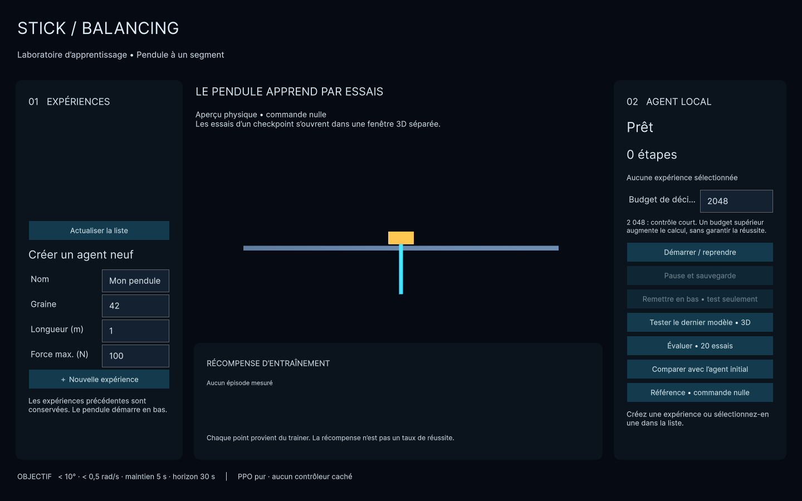
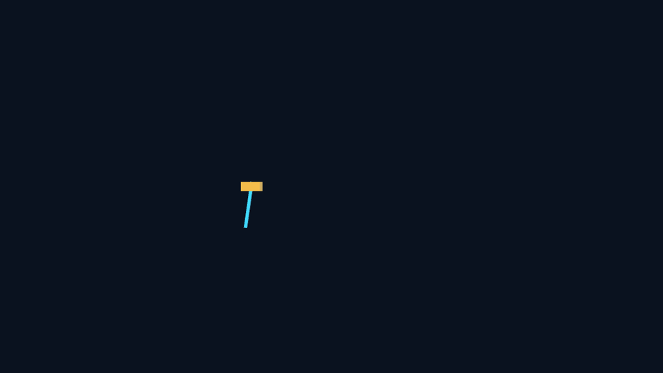

# Stick Balancing — apprentissage local du pendule

Un chariot, un pendule passif et un agent qui apprend a agir sur la force horizontale.
Le produit cible utilise **Unity pour la physique et ML-Agents/PPO pour l'apprentissage
par renforcement local**, conformement a [correction.txt](correction.txt).

**Etat : prototype technique en validation.** Unity et le runtime prive sont installes
sur le poste de developpement. La compilation C# et **13 tests Unity passent**.
Le Player Windows est construit. Un entrainement court puis une reprise ont atteint
4 196 etapes et modifie 7 tenseurs de politique. L'evaluation figee est a **0 / 20**
succes. L'interface finale et `Setup.exe` ne sont pas livres. Aucun succes de swing-up
appris n'est encore revendique.

## La tache scientifique

Le pendule part en bas, avec une petite perturbation reproductible. L'agent observe
la position et la vitesse du chariot, le sinus et le cosinus de l'angle absolu cumule,
et la vitesse angulaire absolue. Une seule action dans `[-1, 1]` commande la force
bornee du chariot. Les articulations sont passives, sans PID ni LQR cache.

Une reussite exige, pendant **5 secondes simulees consecutives**, tous les angles
absolus a moins de **10 degres de la verticale haute**, toutes les vitesses angulaires
absolues sous **0,5 rad/s**, et le chariot dans un rail de **+/-2,5 m**. Les angles
sont periodiques : 360 degres equivaut a 0 degre. L'episode dure au maximum
**30 secondes simulees**. Sortie de rail, limite de duree et erreur physique sont
distinguees dans les logs.

Le prototype est limite a **un segment**. N=2 et N=3 sont codes mais pas encore
entraines ni valides.

## Structure

```
unity/               Physique, agent, scene, construction et tests C#
trainer/             Supervision Python, checkpoints et evaluation separee
configs/             Versions et configuration PPO
tests/migration/     Contrats scientifiques et persistance (sans moteur physique)
packaging/windows/   Preparation, tests et construction Windows
docs/migration/      Audit et preuves
builds/              Outils et sorties locales, ignores par Git
```

Le laboratoire MuJoCo historique a ete retire du workspace a la demande du
proprietaire. Les suppressions restent visibles dans Git.

## Compiler et verifier Unity sur ce poste

Depuis la racine dans PowerShell :

```powershell
.\packaging\windows\prepare-unity.ps1
.\packaging\windows\test-unity.ps1
.\packaging\windows\build-worker.ps1 -UnityEditor .\builds\tools\Unity\Editor\Unity.exe
```

L'editeur est **6000.0.60f1**. Les dependances sont dans
[packages-lock.json](unity/Packages/packages-lock.json). Le script de preparation
telecharge Sentis 2.1.0 depuis Unity et verifie son empreinte.

Rapport : `builds/unity-tests.xml`. Journal : `builds/unity-tests.log`.
Player attendu : `builds/windows/worker/StickBalancingWorker.exe`.

**Attention :** le dernier lancement en mode batch a renvoye le code 198
("No valid Unity Editor license found"). Revalider la licence Unity Personal
avant de rejouer les builds batch.

## Entrainement court de developpement

Apres construction du Player :

```powershell
python -m trainer.launch --check
python -m trainer.launch --train --data-root .\builds\experiments
python -m trainer.launch --train --resume .\builds\experiments\IDENTIFIANT
```

Le calcul utilise le **Python prive** de `trainer/runtime`, avec PyTorch CPU
et ML-Agents verrouillee dans [requirements.lock](trainer/requirements.lock).
Le budget de [ppo-smoke.yaml](configs/ppo-smoke.yaml) est de **2 048 decisions**.
Il verifie la chaine technique ; il ne promet pas un agent competent.

Chaque experience possede un identifiant independant et les fichiers suivants :

| Fichier | Contenu |
|---|---|
| `experiment.json`, `task.json` | Identite, compatibilite, compteurs et parametres physiques |
| `trainer.log` | Diagnostics du processus |
| `events.jsonl` | Evenements et metriques structures, schema versionne |
| `episodes.jsonl` | Resultats physiques des episodes |
| `snapshots/initial.pt` | Etat initial avant optimisation |
| `snapshots/latest.pt` | Dernier checkpoint complet |
| `checkpoints/` | Etats ML-Agents pour reprendre l'optimisation |
| `evaluations/` | Rapports des essais sans apprentissage |

Les sauvegardes contiennent les poids et les etats de l'optimiseur. Le fichier
courant est remplace atomiquement et un checkpoint precedent est conserve. Un verrou
interdit deux trainers sur la meme experience. La reprise ne promet pas de reproduire
exactement le milieu d'un episode.

## Evaluer sans apprentissage

```powershell
.\trainer\runtime\python.exe -I .\trainer\bootstrap.py evaluate --experiment .\builds\experiments\IDENTIFIANT --player .\builds\windows\worker\StickBalancingWorker.exe --checkpoint latest --episodes 20
```

L'evaluation cree un environnement separe et une politique deterministe, sans
optimiseur. Elle verifie que les poids en memoire et le checkpoint restent inchanges
(SHA-256). Comparaisons disponibles : `--checkpoint initial`, `zero`, `random`.
`--exact-down` impose le depart exactement en bas ; `--visible` demande un Player
visible a vitesse reelle.

Des poids modifies prouvent une optimisation, **pas une amelioration de competence**.
Le taux de reussite doit provenir des essais physiques.

## Tests

```powershell
# Suite des contrats de la migration.
python -m pytest -q
```

Les 13 tests Unity verifient le repos en bas, la chute depuis une verticale perturbee,
le signe de la force, sa saturation, le reset, les articulations passives, la
sensibilite au pas physique et la coherence energetique. Les 24 tests Python des
contrats ne remplacent pas ces verifications Unity.

## Prototype Unity verifie



L'interface Windows construite localement permet de creer des experiences
independantes, lancer ou reprendre PPO, mettre une session en pause avec sauvegarde,
choisir un checkpoint et lancer un test fige. La capture provient du Player Unity
construit, pas d'une maquette web.



Ce GIF contient 60 images rendues par Unity entre 2,932 s et 10,828 s de temps
simule. Il montre le checkpoint apres 4 196 etapes, evalue sans optimisation.
Il ne pretend pas demontrer une reussite : le bilan fige est a **0 / 20**.
Les instants, le checkpoint et le resultat sont enregistres dans
[unity-ppo-prototype.json](docs/assets/unity-ppo-prototype.json).

Un installateur de previsualisation est disponible apres construction sous
`packaging/windows/output/StickBalancing-Prototype-Setup.exe`. Son usage et ses
limites sont documentes dans [la procedure Windows](packaging/windows/README.md).

## Livraison et travail restant

L'objectif reste un installateur autonome, sans Python ni Unity a installer chez
l'utilisateur final. Les outils de developpement presents sur ce PC ne constituent
pas cette distribution.

- **A (bloquant)** : revalider la licence Unity Personal pour les builds batch.
- **B (bloquant)** : lancer une campagne multi-seeds et atteindre au moins 18/20
  succes avec maintien de 5 s depuis le bas.
- **C** : N=2 puis N=3 — valider physique, observations et recompenses separement.
- **D** : interface UXML/USS complete, ecrans separes, navigation clavier, DPI.
- **E** : tester le Setup sur une machine Windows propre, hors ligne, de bout en bout.
- **F** : mesures de performance (etapes/s, RAM, FPS) sur materiel de reference.
- **G** : empreintes SHA de toutes les wheels et notices de redistribution completes.
- **H** : tests d'interface (redimensionnement, crash worker, seconde instance).

Voir [l'audit](docs/migration/phase-0.md) et la
[distribution Windows](packaging/windows/README.md). Aucune garantie de convergence
n'est revendiquee.
